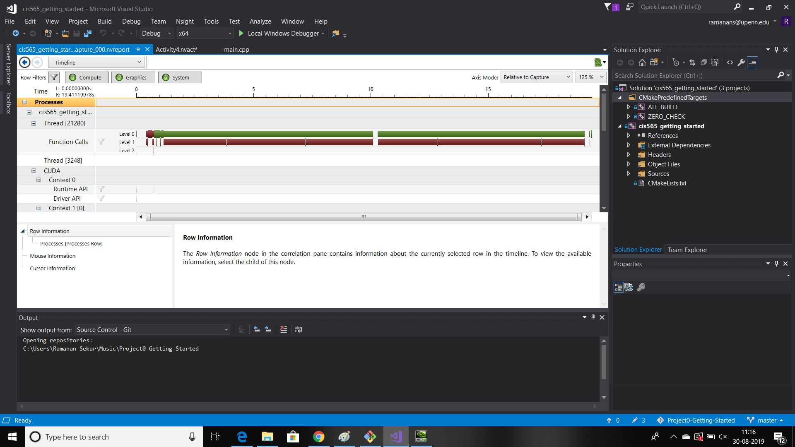

Project 0 Getting Started
====================

**University of Pennsylvania, CIS 565: GPU Programming and Architecture, Project 0**

* Ramanan Sekar
  * LinkedIn: https://www.linkedin.com/in/ramanansekar/ , twitter: https://twitter.com/naanboi
* Tested on: Windows 10, i7-7700HQ CPU @2.80 GHz 16 GB, GTX 1060 Max Q, 6 GB. Personal computer

### (README)

* Compute Capability of CUDA-Compatible GPU: 6.1
* WebGL Result:

* DXR Result:

* Building and Running: Modification

* NSight Analysis Result:

* NSight Debugging:

